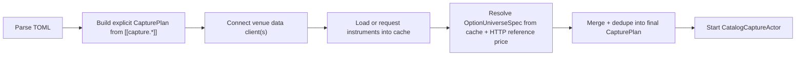

# Option Universe Manager Design

## Goal

Design a Nautilus Trader-aligned **Option Universe Manager** that solves our
current options capture pain point:

- stop hand-editing expiring option `instrument_id`s in TOML
- keep **per-instrument parquet** as the source of truth
- support a future path where the same universe logic can drive
  capture, research dashboards, and live strategies

This document updates the earlier draft to match the actual Nautilus startup
and subscription lifecycle.

## Business Need

Our current options profiles, such as
[examples/capture.deribit-btc.toml](/Users/yfclark/nautilus_catalog_capture/examples/capture.deribit-btc.toml),
hard-code near-term call/put instrument IDs. That causes three recurring
problems:

1. expiry rolls make the config stale
2. ATM drifts make the chosen strikes stop representing the intended window
3. the current capture runtime only consumes a resolved `CapturePlan`; it does
   not discover or rotate option members itself

The manager is meant to fix the **data acquisition layer** for the parts of a
Derivatives Monkey-style research stack that depend on rolling option universes:

- IV surface / skew / term structure
- GEX / max pain
- near-expiry option quote / greeks monitoring
- basis / carry studies when paired with perp / mark / index / funding

It does **not** compute those panels itself. It ensures the right raw option
members are recorded continuously enough for those panels to be recomputed
offline.

## Non-Goals

V1 does not attempt to provide:

- a full-market option scanner
- OI-ranked or volume-ranked selection
- `OptionChainSlice` as the primary capture artifact
- multi-consumer runtime intent merging
- runtime refresh for venues beyond Deribit / Bybit / OKX
- a generic cross-adapter DSL accepted upstream immediately

## What Problem Are We Actually Solving?

We are not trying to “auto-fill TOML”.

We are trying to represent a **stable logical intent** such as:

- venue: Deribit
- underlying: BTC
- settlement: BTC
- expiry: nearest future expiry within 45 days
- strikes: ATM plus/minus N
- include hedge leg: BTC perpetual

and map that intent onto a **changing concrete member set** such as:

- `BTC-PERPETUAL.DERIBIT`
- `BTC-26JUN26-65000-C.DERIBIT`
- `BTC-26JUN26-65000-P.DERIBIT`
- `BTC-26JUN26-66000-C.DERIBIT`
- `BTC-26JUN26-64000-P.DERIBIT`

This is fundamentally the same shape as other “logical scope -> rotating
members” problems in Nautilus.

## Why This Must Follow Nautilus Style

To be useful beyond catalog capture, and to have any plausible upstream path,
the design should match existing Nautilus patterns:

1. logical subscription identity is separate from concrete venue routes
2. runtime state lives in a manager, not in ad hoc CLI glue
3. cache and request APIs are reused as the instrument truth layer
4. lifecycle matters: initial resolve, refresh, reconnect, teardown
5. consumers should be able to reuse the same logical universe policy

This is why a capture-only “resolver script” is too narrow.

## Current Nautilus Constraints

### Live startup timing

Nautilus `LiveNode` connects data clients **before** the trader is started and
flushes instrument events into cache first. See
[nautilus_trader/crates/live/src/node.rs](/Users/yfclark/nautilus_trader/crates/live/src/node.rs).

Relevant sequence:

1. connect data clients
2. flush pending data so instruments reach cache
3. connect execution clients
4. start trader / actors

This means any cache-dependent universe resolution must happen **after**
data-client connect and instrument load, not inside plain TOML parsing.

### Current capture actor behavior

[crates/catalog-capture-runtime-adapter/src/actor.rs](/Users/yfclark/nautilus_catalog_capture/crates/catalog-capture-runtime-adapter/src/actor.rs)
currently:

1. consumes an immutable `CapturePlan`
2. bootstraps instruments from cache or `request_instrument`
3. subscribes once in `on_start`

Stock Nautilus capture actors do not expose a generic API to mutate plans or
apply universe deltas. V1.5 adds a project-local path in
`catalog-capture-runtime-adapter` (`DynamicOptionUniverseManager` +
`CatalogCaptureActor::apply_dynamic_option_universe_refresh`) for Deribit only.
Any design claiming runtime refresh without actor changes would still be
incorrect for upstream Nautilus today.

### Adapter behavior on missing instruments

Deribit explicitly fails fast when subscribing to uncached instruments unless
`auto_load_missing_instruments=true`, and can lazily fetch them only when that
flag is enabled. See
[nautilus_trader/crates/adapters/deribit/tests/data_client.rs](/Users/yfclark/nautilus_trader/crates/adapters/deribit/tests/data_client.rs).

That is another reason V1 should resolve the universe from a loaded instrument
set before starting the capture actor.

## Relation To OptionChain

Nautilus already has a strong runtime abstraction for option chains:

- `subscribe_option_chain(...)`
- `OptionChainManager`
- `OptionChainSlice`

References:

- [nautilus_trader/crates/data/src/engine/mod.rs](/Users/yfclark/nautilus_trader/crates/data/src/engine/mod.rs)
- [nautilus_trader/crates/data/src/option_chains/manager.rs](/Users/yfclark/nautilus_trader/crates/data/src/option_chains/manager.rs)
- [nautilus_trader/crates/adapters/deribit/examples/node_option_chain.rs](/Users/yfclark/nautilus_trader/crates/adapters/deribit/examples/node_option_chain.rs)

`OptionChain` is highly relevant, but it solves a different layer:

- it assumes a known `OptionSeriesId`
- it aggregates a fixed series into a runtime slice
- it handles ATM-relative strike activation within that series

It does **not** directly solve:

- which expiry should be selected in the first place
- when to roll to the next expiry
- how to turn a logical universe into a per-instrument capture plan

### What We Should Borrow From OptionChain

- resolve from cache-backed instruments
- filter expired instruments
- group by expiry and settlement
- use ATM-relative strike selection semantics
- treat the active instrument set as runtime state

### What We Should Not Borrow As The Main Output

- `OptionChainSlice` as the primary capture record

Our source of truth remains:

- `instruments`
- `quotes`
- `option_greeks`
- later `trades` / selected `book_deltas`

## Relation To Nautilus Issue #4240

Issue:

- [RFC: Polymarket adapter-local rolling Up/Down scope via custom data #4240](https://github.com/nautechsystems/nautilus_trader/issues/4240)

That RFC is structurally similar because it separates:

- stable logical intent
- rotating concrete members
- runtime-managed refresh
- logical identity vs routing identity

We should borrow that mindset, especially:

- a stable logical key
- resolved state snapshots
- refresh / rollover lifecycle
- delta-oriented updates

But our initial output is different.

#4240 is closer to:

- logical scope -> adapter-local slice

Our V1 is closer to:

- logical universe -> explicit instrument set -> `CapturePlan`

## Design Principles

1. **Per-instrument parquet stays primary**
2. **Universe discovery happens outside the capture actor**
3. **Cache-backed discovery is the preferred path**
4. **Lifecycle is explicit**
5. **V1 is static for the lifetime of a capture job**
6. **Dynamic refresh is a later phase requiring runtime changes**
7. **The core abstraction should be reusable by strategies later**

## Proposed Abstractions

### `OptionUniverseSpec`

Describes logical intent, not concrete instrument IDs.

Suggested fields:

- `venue_id`: link to a specific `[[venues]]` entry
- `underlying`
- `settlement_currency` (optional)
- `include_perp`
- `families`
- `expiry_policy`
- `strike_policy`
- `refresh_interval_secs` (declared now, implemented later)

Example:

```toml
[[capture.option_universe]]
venue_id = "deribit_main"
underlying = "BTC"
settlement_currency = "BTC"
include_perp = true
families = ["instruments", "quotes", "option_greeks", "mark_prices", "index_prices", "funding_rates"]

[capture.option_universe.expiry_policy]
mode = "nearest"
days_max = 45

[capture.option_universe.strike_policy]
mode = "atm_relative"
strikes_above = 2
strikes_below = 2
```

### `OptionUniverseKey`

Stable logical identity used by a manager.

It must include enough fields to avoid collisions:

- `venue_id`
- `underlying`
- `settlement_currency`
- `include_perp`
- `families`
- `expiry_policy`
- `strike_policy`

It should **not** include:

- `resolved_at_ns`
- selected expiry
- concrete instrument IDs

Those belong to the resolved snapshot, not the logical key.

### `ResolvedOptionUniverse`

Resolved snapshot at a point in time.

Suggested fields:

- `key`
- `resolved_at_ns`
- `selected_expiry_ns`
- `atm_reference`
- `selected_strikes`
- `perp_instrument_id`
- `option_instrument_ids`
- `all_instrument_ids`
- `next_refresh_at_ns`

### `OptionUniverseDelta`

Diff between two resolved snapshots.

Suggested fields:

- `added_instruments`
- `removed_instruments`
- `unchanged_instruments`
- `rollover_reason`

V1.5 implements `DynamicOptionUniverseDelta` / `DynamicOptionUniverseChange`
in `catalog-capture-runtime-adapter`. V2 may extend rollover metadata
(`rollover_reason`, persisted resolution snapshots).

## Placement

To stay reusable:

- put `OptionUniverseSpec`, `OptionUniverseKey`, `ResolvedOptionUniverse`,
  and pure resolve logic in `catalog-capture-core`
- keep V1 capture integration in `catalog-capture-cli`
- keep any future live runtime actor/delta application in
  `catalog-capture-runtime-adapter`

This split also creates a cleaner future path if the logical manager design is
ever proposed upstream in Nautilus.

## Discovery Source

The manager should not be hard-wired to TOML parsing or to a particular actor.

Define a discovery abstraction conceptually like:

- list available instruments for a venue / underlying
- provide enough metadata to group by expiry and settlement
- provide or help derive an ATM reference input

V1 can implement this narrowly for Deribit through the already-loaded cache and
existing request paths, without trying to generalize every adapter up front.

### Core boundary

To preserve dependency hygiene:

- pure resolve policy and merge/dedupe helpers belong in `catalog-capture-core`
- cache access, HTTP ticker lookups, and venue-specific discovery glue belong in
  `catalog-capture-cli`

`catalog-capture-core` should not gain a dependency on live cache handles or
venue HTTP clients for V1.

## V1 Lifecycle

V1 is **not** a runtime-refreshing manager inside a long-lived capture actor.
It is a **pre-start universe expansion step** executed after venue instruments
exist but before the capture actor is started.

### Lifecycle Diagram



### Why This Matches Nautilus Better

This mirrors how `LiveNode` already treats instruments:

- instrument availability is a post-connect concern
- cache is the authoritative loaded set for subsequent consumers
- actors should start after the required market structure is known

### V1 runner integration

This must be explicit because the current
[crates/catalog-capture-cli/src/runner.rs](/Users/yfclark/nautilus_catalog_capture/crates/catalog-capture-cli/src/runner.rs)
creates `CatalogCaptureActor` before `node.run()`, while `node.run()` is what
normally drives data-client connect and cache population.

For V1 we choose the more conservative path:

1. parse TOML into:
   - explicit `CapturePlan`
   - zero or more `OptionUniverseSpec`
2. run a **preflight discovery phase** in the CLI before the capture actor is
   created
3. in that phase:
   - create and connect the required venue data client(s) or equivalent
     discovery plumbing
   - load or request instruments
   - fetch the ATM reference input via venue HTTP when needed
   - resolve each `OptionUniverseSpec`
4. merge/dedupe the resolved output into the final `CapturePlan`
5. create `CatalogCaptureActor`
6. start the normal capture job

In other words, V1 does **not** rely on an undocumented
"connect-after-build-but-before-actor-start" hook inside `LiveNode`.

This also means the CLI implementation may temporarily own two phases:

- discovery preflight
- capture runtime

That split is acceptable for V1 because the actor remains unchanged and the
resolved plan is static for the life of the job.

### V1 Scope

V1 means:

- resolve once per capture job (default when `runtime.option_universe_refresh`
  is disabled or omitted)
- job remains static after startup
- rerun the job to pick up a new expiry or ATM shift

This is already enough to eliminate manual profile edits.

## V1.5 And V2 Lifecycle

### V1.5

**Status: implemented for Deribit, Bybit, and OKX (2026-06).**

Enable with `[runtime.option_universe_refresh]` in TOML. Example:
[examples/capture.deribit-btc-universe-autorefresh.toml](/Users/yfclark/nautilus_catalog_capture/examples/capture.deribit-btc-universe-autorefresh.toml).

Shipped capabilities:

- `DynamicOptionUniverseManager` in `catalog-capture-runtime-adapter`
- periodic cache-backed re-resolve via `refresh_from_cache`
- `DynamicOptionUniverseDelta` with per-universe add/remove instrument lists
- actor applies bootstrap + subscribe/unsubscribe on non-empty deltas
- `OnlineOptionMetricsObserver::apply_universe_change` keeps metrics in sync
- `active_capture_plan()` merges static explicit capture entries with the
  current dynamic universe plan

Constraints:

- runtime refresh is limited to Deribit / Bybit / OKX
  (`OptionUniverseVenueKind::supports_runtime_refresh`)
- universe-resolution metadata is persisted as catalog JSONL (not yet a typed
  parquet family)

### V2

Potential future features:
- expiry rollover smoothing and persisted resolution metadata
- multi-consumer sharing
- strategy and dashboard consumers
- OI-ranked / liquidity-ranked selection (full Step 9a)

## Resolve Algorithm For V1

For Deribit BTC, the V1 algorithm should be deterministic:

1. read cached instruments for `venue_id`
2. filter to `CryptoOption`
3. filter by `underlying`
4. filter expired instruments using current clock
5. if configured, filter by `settlement_currency`
6. group by expiry
7. select the nearest expiry within `days_max`
8. compute ATM reference price
9. choose strikes using the strike policy
10. map each selected strike to call / put members
11. optionally add the perpetual hedge instrument
12. expand the configured families into explicit capture specs

## ATM Reference Policy

This must be deterministic in V1.

V1 cannot assume quote / mark / index data already exists in cache at resolve
time. After data-client connect, instruments are typically available first while
price-bearing market data may still be absent.

Therefore, **V1 ATM resolution uses a venue HTTP/public-data preflight step
before falling back to cache-resident market data**.

### Deribit BTC fallback order

Canonical hedge/reference instrument:

- `BTC-PERPETUAL.DERIBIT`

Canonical index-related reference family:

- `IndexPriceUpdate` for `BTC-PERPETUAL.DERIBIT`

Fallback order:

1. Deribit HTTP/public ticker reference for `BTC-PERPETUAL.DERIBIT`
2. cached `BTC-PERPETUAL.DERIBIT` mark-like reference if available
3. cached `BTC-PERPETUAL.DERIBIT` quote midpoint if available
4. cached `IndexPriceUpdate` for `BTC-PERPETUAL.DERIBIT` if available
5. fail universe resolution

V1 should **not** silently guess ATM from arbitrary option strikes when no
underlying reference exists.

### Tie-break rule

If two strikes are equidistant from ATM:

- prefer the lower strike

This is arbitrary but deterministic, which is more important for V1.

### Failure policy

If no ATM reference can be obtained:

- fail the universe resolution for that spec
- fail the job fast

V1 does not define a TOML-level `best_effort` flag yet. That can be revisited
later if partial-universe startup becomes desirable.

## Merge And Dedupe Rules

The final `CapturePlan` is the union of:

- explicit `[[capture.<family>]]` entries
- expanded entries produced from each `option_universe`

### Per-family dedupe

Dedupe by family-specific identity:

- instrument-scoped families: by `instrument_id`
- `custom_data`: by `DataType`
- bars: by `bar_type`
- book deltas: by `(instrument_id, book_type)`

### Precedence

- explicit entries are preserved as-is
- universe-expanded entries only add missing specs

Example:

- if `include_perp = true` and the explicit plan already contains
  `BTC-PERPETUAL.DERIBIT` quotes, only one quote subscription should remain

### `plan.is_empty()` interaction

Because current CLI validation rejects an empty `CapturePlan`, the
`option_universe` expansion must happen **before** final emptiness validation.

This allows a profile containing only:

- `[[venues]]`
- `[[capture.option_universe]]`

to become valid once the universe is expanded into explicit family specs.

## Empty Universe Policy

V1 should be strict.

Fail fast when:

- no unexpired options match the filters
- no expiry falls within `days_max`
- ATM reference cannot be computed
- no call/put pair can be formed for the selected strike window

This is better than silently producing a tiny or malformed universe.

## Data Continuity And Lineage

Even in V1, we should design for research traceability.

At minimum, each universe resolution event should be loggable with:

- logical key
- resolved time
- selected expiry
- ATM reference
- selected strikes
- final instrument IDs

For V1 this can live in logs and job metadata.

V1.5+ persists universe-resolution metadata as JSONL at
`metadata/option_universe_resolutions.jsonl` under the catalog root. Startup
resolve and runtime refresh rotations append one record per event so rollover
boundaries can be correlated with parquet partitions via `resolved_at_ns`.

## Mapping To Roadmap Step 9a

Roadmap item:

- `underlying = "BTC"` + `expiry_days <= 45` + `top_n_by_open_interest`
- timed `request_instruments` refresh

Mapping:

| Roadmap 9a item | V1 | V1.5 | V2 |
|---|---|---|---|
| Underlying-based discovery | yes | yes | yes |
| Expiry window | yes | yes | yes |
| ATM-relative selection | yes | yes | yes |
| Timed refresh | no | yes (Deribit/Bybit/OKX) | yes |
| `request_instruments`-driven refresh | limited / startup only | yes (venue cache) | yes |
| `top_n_by_open_interest` | no | no | yes |
| full-chain + liquidity-ranked universe | no | partial | yes |

So V1 is a valid **9a-lite** slice, not full Step 9a completion.

## Venue-Specific Notes For V1

### Perpetual hedge ID derivation

For Deribit V1:

- underlying `BTC` -> hedge/perp instrument `BTC-PERPETUAL.DERIBIT`

This mapping should be explicit in code and tests rather than inferred loosely
from arbitrary cached instruments.

### Multi-venue startup

When multiple `[[venues]]` entries exist:

1. connect/load discovery prerequisites for all configured venues
2. resolve each `OptionUniverseSpec` against its `venue_id`
3. merge all expanded specs into one final `CapturePlan`

V1 option universe resolution still only targets Deribit, but the lifecycle
should already be documented in multi-venue terms to avoid future ambiguity.

### Strike policy naming

The TOML fields:

- `strikes_above`
- `strikes_below`

are intentionally aligned with Nautilus `StrikeRange::AtmRelative` semantics.

## Reuse Targets

If kept as a reusable logical layer, this design can later serve:

1. `catalog-capture-cli`
2. options strategy warmup / watchlist construction
3. dashboard or research panel universe selection
4. upstream-style runtime managers similar in spirit to `OptionChainManager`

That reuse potential is the main reason not to collapse the whole design into a
CLI-only resolver.

## Acceptance Criteria For V1

V1 is complete when all of the following are true:

1. a Deribit BTC profile can declare `capture.option_universe` without listing
   concrete option IDs
2. after venue connect and instrument load, the system resolves the nearest
   expiry and ATM-relative strike set deterministically
3. the expanded `CapturePlan` dedupes cleanly against explicit perp entries
4. the capture actor starts unchanged and writes per-instrument parquet for the
   resolved option members
5. a test proves that rolling the fixture expiry changes the selected
   instrument IDs without editing the profile

## Test Strategy

At minimum:

1. pure unit tests for expiry selection and strike selection
2. unit test for merge / dedupe behavior
3. golden fixture test for Deribit BTC resolution
4. integration smoke:
   parse spec -> load instruments -> resolve -> build plan

## Recommended Implementation Order

1. add `capture.option_universe` schema to CLI config
2. add pure resolve types and logic to `catalog-capture-core`
3. add a startup preflight phase in `catalog-capture-cli`:
   connect/load instruments -> resolve universes -> build final plan
4. add Deribit BTC-only support for V1
5. add example profile and tests
6. add Deribit runtime refresh (V1.5) — done; extend to other venues in V2

## Summary

The right first implementation is:

- **not** direct `OptionChain` capture
- **not** CLI-time TOML-only expansion
- **not** a capture-only one-off script

The right V1 is:

- a reusable logical `OptionUniverseSpec`
- cache-backed post-connect resolution
- one-shot expansion into a deduped `CapturePlan`
- unchanged capture actor for the lifetime of the job (unless V1.5 refresh is
  enabled)

V1.5 (Deribit / Bybit / OKX) adds:

- `DynamicOptionUniverseManager` with delta-based refresh
- actor-side subscribe/unsubscribe and metrics sync on rotation

The right longer-term direction (V2) is:

- multi-venue runtime refresh
- persisted resolution metadata
- reuse by both capture and strategy consumers

That path is closest to Nautilus Trader’s existing style and most likely to
remain useful if the abstraction later grows into something suitable for
upstream discussion.
